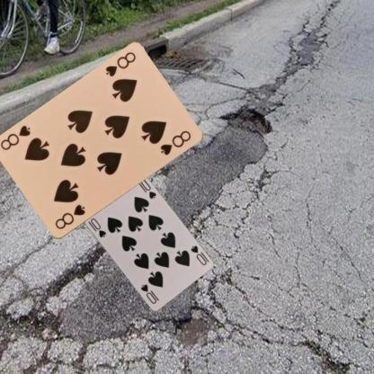
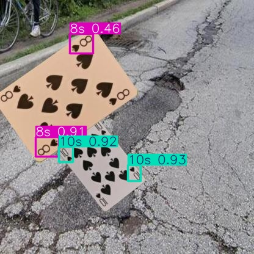

## Demo

### Input

### Output

## Model Comparison
| Model | Precision | Recall | F1 Score |
|---|---|---|---|
| 10 Epochs | 0.8665 | 0.9902 | 0.9242 |
| 50 Epochs | 0.9672 | 0.9972 | 0.9820 |

Training for 50 epochs significantly reduced false positives:

- 10 epochs: 1158 false positives
- 50 epochs: 257 false positives

The largest remaining errors occur on:
- overlapping cards
- partially occluded cards
- visually similar ranks/suits (especially 8s and Aces)