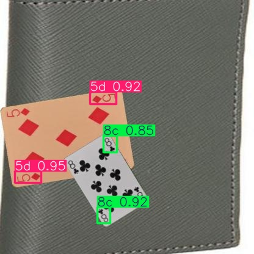
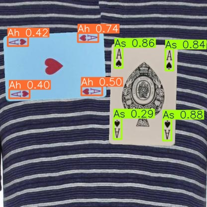
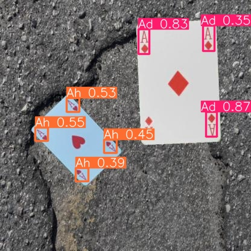

# Poker Card Recognizer

A YOLOv8-based playing card corner detection project trained on a custom card dataset.

## How It Works

The project uses YOLOv8 to detect playing card corner indices from images.

The dataset labels the top-left and bottom-right card corners rather than full card bodies. The model therefore learns to detect visible rank/suit regions instead of complete physical cards.

## Features

- YOLOv8-based card corner detection
- Evaluation script with TP/FP/FN metrics
- Failure case analysis
- Command-line card detection
- Comparison between 10-epoch and 50-epoch models

## Demo

### Input


### Output


## Installation

```bash
pip install -r requirements.txt
```

## Usage

## Dataset

- ~20,000 annotated images
- YOLO-format labels
- Downloaded using KaggleHub
```bash
python download_dataset.py
```
- The test, train and valid folders should be directly under the main folder

### Train the model

```bash
python train_model.py
```

### Evaluate the model

```bash
python evaluate_model.py
```

### Detect cards in an image

```bash
python detect_cards.py demo.jpg
```

### Example Output

```text
As: 0.88
Ah: 0.74
```

Evaluation metrics are computed using IoU-based matching between predicted and labeled card corner regions.

## Project Structure

```text
.
├── detect_cards.py
├── train_model.py
├── evaluate_model.py
├── download_dataset.py
├── data.yaml
├── requirements.txt
└── evaluation_results/
```

## Model Comparison

| Model | Precision | Recall | F1 Score |
|---|---|---|---|
| 10 Epochs | 0.8665 | 0.9902 | 0.9242 |
| 50 Epochs | 0.9672 | 0.9972 | 0.9820 |

Training for 50 epochs significantly reduced false positives:

- 10 epochs: 1158 false positives
- 50 epochs: 257 false positives

## Failure Cases

The dataset labels only the top-left and bottom-right card indices rather than the entire card body.

As a result, the model occasionally predicts additional detections on the top-right or bottom-left regions of symmetric cards. These detections are counted as false positives during evaluation even though the visual patterns are very similar to the labeled regions.

### Failure Examples

| Example | Description |
|---|---|
|  | Detected wrong corners |
|  | Detected extra corners |
|  | Detected extra corners |
